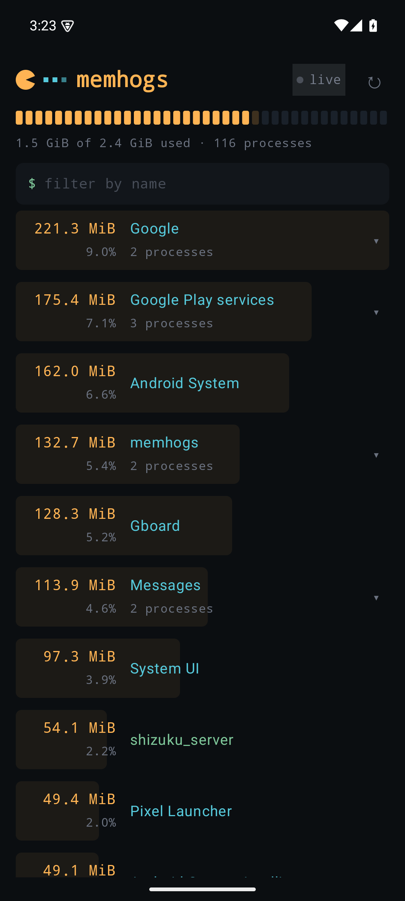
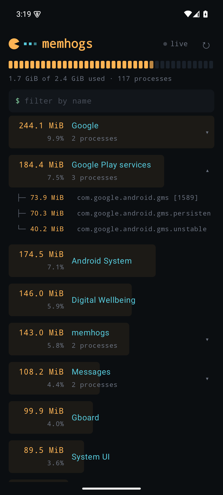
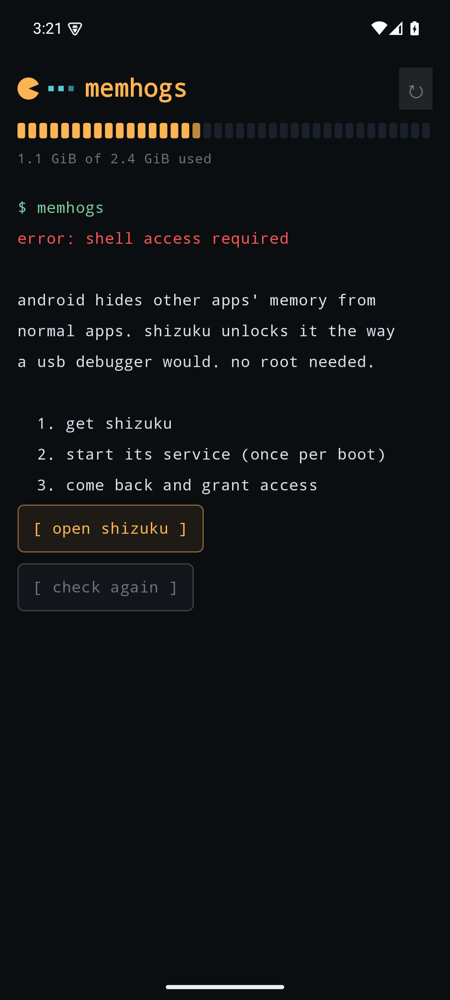

# memhogs for Android

The Android companion to [memhogs](https://github.com/cicerothoma/memhogs):
open it and see which apps are using your phone's memory, largest first,
with every helper process rolled up into the app that owns it. Chrome's
sandboxed renderers count toward Chrome, not toward twelve rows of
`sandboxed_process` noise.

<p>
  
  
  
</p>

## Why it needs Shizuku

Android does not let a normal app see other apps' memory. That is why
every "RAM monitor" on the Play Store shows one total and nothing else.
memhogs reads per-app memory the same way a USB debugger would, through
[Shizuku](https://shizuku.rikka.app/), which grants shell-level access
without root:

1. Install Shizuku from the Play Store, or from its
   [GitHub releases page](https://github.com/RikkaApps/Shizuku/releases/latest)
   if the Play Store reports it as incompatible with your device. That
   happens on very new Android versions before the listing catches up;
   the APK itself installs and works fine.
2. In Shizuku, start the service. On Android 11+ this takes one tap via
   wireless debugging; it survives until the next reboot.
3. Open memhogs and grant it access when prompted.

Without Shizuku, memhogs still shows the device-wide used/total bar from
public APIs, and explains how to unlock the rest.

## What the numbers mean

Memory is PSS (proportional set size), read from `dumpsys meminfo`. A
page shared by N processes counts 1/N toward each, so summing all apps
never counts the same physical memory twice. This is the same fair-share
metric the memhogs CLI uses on Linux, and the same one Android itself
uses to decide which app to kill under pressure.

- Amber numbers are memory, cyan names are installed apps, green names
  are system daemons that do not resolve to an installed package.
- An app using 15% or more of RAM gets its share flagged in red.
- Tap a row to expand its member processes with their PIDs.

## Install

Grab the APK from the
[releases page](https://github.com/cicerothoma/memhogs-android/releases)
and sideload it. F-Droid and Play Store listings are planned.

Requires Android 8.0 or newer. The full experience requires the Shizuku
service to be running.

## Building

```sh
./gradlew assembleDebug   # APK in app/build/outputs/apk/debug/
./gradlew test            # parser and grouping unit tests
```

Kotlin and Jetpack Compose, with the Shizuku API as the only non-AndroidX
dependency.

## License

MIT
